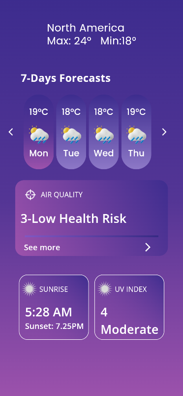
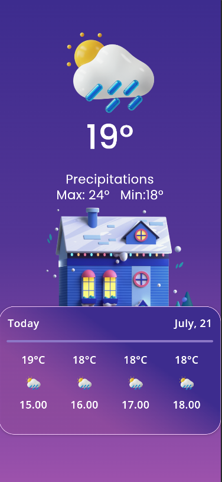

# weather_app

A new Flutter project.

## Getting Started

## 📹 Whole Project overview

Check out the app  on YouTube:

**Homepage()**

The Homepage widget is a stateless widget that builds the main 
UI of the app. It includes a background color (instead of an image) and 
styled text using the GoogleFonts package. Here's what it contains:

*A Scaffold with a custom background color (Color(0xFF362A84)).

*Centered text displaying "Weather App" as a title.

*Typography powered by Google Fonts, e.g., using Poppins or any other chosen font.

**Image:**

**Tools & Packages Used**
| Package                 | Purpose                                 |
|-------------------------|-----------------------------------------|
| `google_fonts`          | Custom typography matching Figma design |
| `flutter/material.dart` | Core UI widgets                         |

**Next  Page**

**Final Page**

         